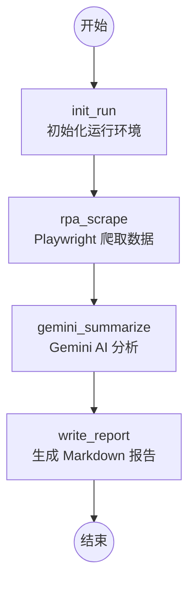

# rpa_v0.py 架构与功能说明

本文档详细介绍了 `rpa_v0.py` 脚本的整体架构、状态管理以及各个函数的功能。该脚本是一个结合了 **Playwright** (自动化测试/爬虫)、**LangGraph** (工作流管理) 和 **Google Gemini** (AI 分析) 的自动化 RPA 工具。

## 1. 整体架构

脚本采用了 **状态机 (State Machine)** 架构，利用 `langgraph` 库定义了一个线性的工作流。

### 1.1 工作流图示

### 1.2 核心技术栈
- **Playwright**: 用于驱动浏览器进行网页访问、截图、追踪 (Trace) 和 DOM 元素提取。
- **LangGraph**: 用于编排 RPA 的各个阶段（节点），维护运行状态。
- **Google GenAI (Gemini)**: 用于对爬取到的 JSON 数据进行总结分析，或在报错时提供修复建议。
- **dotenv**: 管理环境变量（如 API Key, 目标 URL 等）。

---

## 2. 状态定义 (State)

脚本通过 `State` 类（继承自 `TypedDict`）在各个节点之间传递数据：

| 字段 | 类型 | 说明 |
| :--- | :--- | :--- |
| `url` | `str` | 目标网页的 URL |
| `run_id` | `str` | 本次运行的唯一 ID |
| `artifacts_dir` | `str` | 产物存储目录（路径包含 run_id） |
| `items` | `List[Dict]` | 爬取到的原始数据列表 |
| `page_title` | `str` | 目标网页的标题 |
| `report_md` | `str` | Gemini 生成的 Markdown 报告内容 |
| `error` | `str` | 运行过程中捕获的错误信息 |

---

## 3. 函数功能详解

### 3.1 辅助工具函数

#### `now_iso() -> str`
- **功能**: 获取当前 UTC 时间的 ISO 格式字符串。
- **用途**: 为日志提供时间戳。

#### `audit_append(artifacts_dir: str, event: Dict) -> None`
- **功能**: 向指定目录的 `audit.jsonl` 文件中追加一行 JSON 日志。
- **用途**: 实现操作审计（证据链），记录每个节点的开始、结束及关键元数据。

---

### 3.2 工作流节点函数

#### `init_run(state: State) -> Dict`
- **功能**: 初始化工作流。
- **逻辑**: 
    1. 生成短唯一 ID (`run_id`)。
    2. 创建基于该 ID 的产物目录 (`artifacts_dir`)。
    3. 确定目标 `url`（优先使用 state 传入的，其次使用环境变量）。
- **返回**: 更新后的 `run_id`, `artifacts_dir` 和 `url`。

#### `rpa_scrape(state: State) -> Dict`
- **功能**: 执行基于 Playwright 的自动化爬取。
- **逻辑**:
    1. 启动无头模式的 Chromium 浏览器。
    2. 开启 **Tracing**（记录截图和快照作为证据）。
    3. 访问网页并等待网络空闲。
    4. 截图并保存至 `page.png`。
    5. 使用 CSS 选择器 (`.quote`) 提取内容、作者和标签。
    6. 将结果保存为 `items.json`。
    7. 停止 Tracing 并导出 `trace.zip`。
- **错误处理**: 如果失败，捕获异常并存入 `state["error"]`。

#### `gemini_summarize(state: State) -> Dict`
- **功能**: 调用 Gemini 大模型进行智能分析。
- **逻辑**:
    - **无报错时**: 将爬取的 `items`（取前 20 条样本）发送给 Gemini，要求生成包含页面标题、条目数、高频标签、作者统计以及 RPA 改进建议的中文报告。
    - **有报错时**: 将 Playwright 的报错信息发送给 Gemini，请求获取最多 8 条排查修复建议。
- **返回**: 生成的 Markdown 文本 `report_md`。

#### `write_report(state: State) -> Dict`
- **功能**: 将 Gemini 生成的报告写入文件。
- **逻辑**: 读取 `state["report_md"]`，将其写入名为 `report.md` 的文件。

---

### 3.3 构建与启动

#### `build_graph()`
- **功能**: 定义 LangGraph 状态机结构。
- **逻辑**: 添加上述四个节点，并设置 `START -> init_run -> rpa_scrape -> gemini_summarize -> write_report -> END` 的线性边。

#### `__main__`
- **功能**: 程序的入口。
- **逻辑**: 调用 `build_graph().invoke({})` 启动工作流，并在控制台打印产物目录。
